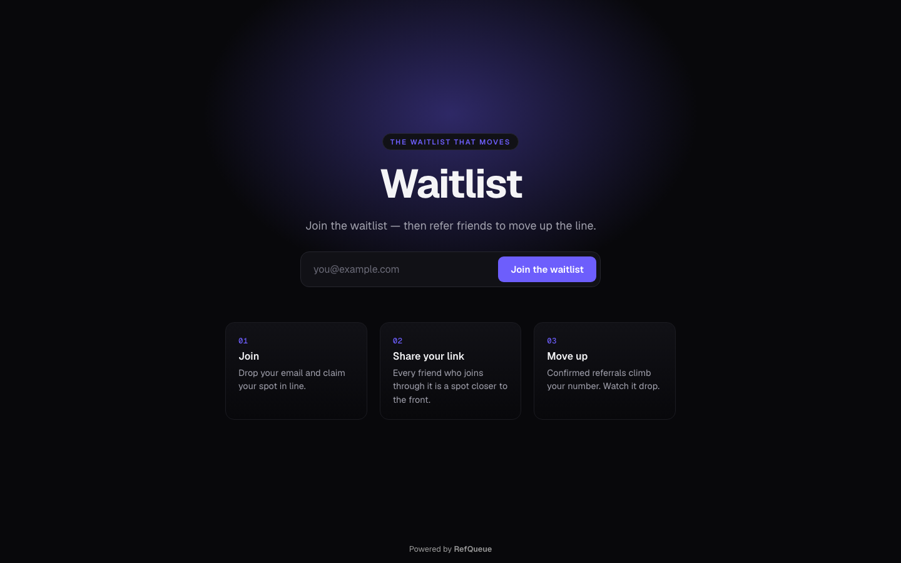
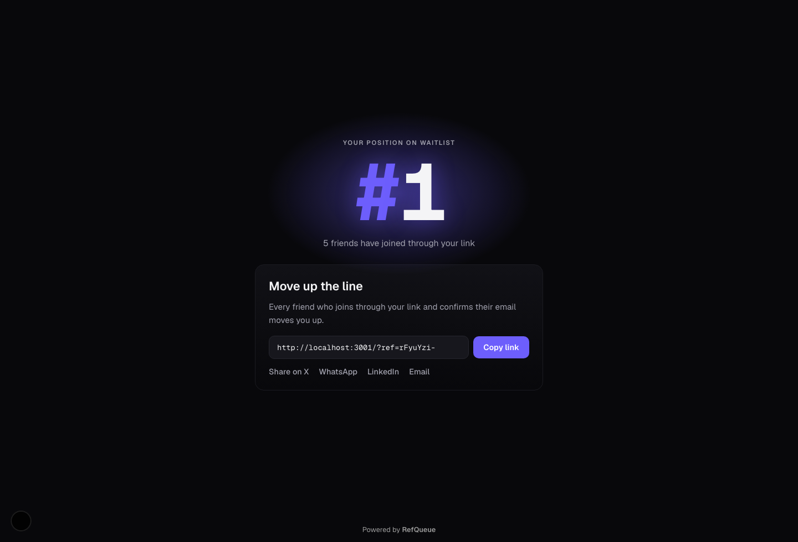

# RefQueue

**Open-source waitlist with built-in referrals.** The "refer friends to skip the line"
mechanic behind Superhuman's and Robinhood's launches — the one GetWaitlist and Viral
Loops paywall at $35–50/mo — free, self-hosted, and yours.



They took the free plan away and the category leader just got acquired. Here's the
open-source one that can't be paywalled or taken from you.

## What it does

- **Email signup → a live queue position** ("You're #247").
- **A unique referral link per signup** with X / WhatsApp / LinkedIn / email share buttons.
- **Confirmed referrals move you up the line** — every friend who joins *and confirms
  their email* bumps your position. Unconfirmed signups never count.
- **Configurable reward milestones** ("refer 3 → early access") with automatic emails.
- **A maker dashboard** — signups, positions, top referrers, a 30-day chart, CSV export.
- **Themeable** — logo, color, and copy via environment variables.
- **"Powered by RefQueue" credit** — on by default, removable with one env var.



## Anti-gaming

A referral counts **only after the referred email completes double opt-in.** That makes a
fake referral cost a real, verifiable inbox — the single rule that keeps the numbers honest.
Per-IP rate limiting and disposable-email blocking back it up.

## Quick start

RefQueue is a Next.js app backed by [Supabase](https://supabase.com) (Postgres + Auth).
Set up Supabase first — see [`supabase/README.md`](supabase/README.md) — then deploy.

### Deploy to Vercel

[](https://vercel.com/new/clone?repository-url=https://github.com/alinearonsky/refqueue&env=SUPABASE_URL,SUPABASE_SERVICE_ROLE_KEY,SUPABASE_ANON_KEY,APP_BASE_URL,WAITLIST_NAME,EMAIL_FROM,RESEND_API_KEY,MAKER_EMAIL,MAKER_PASSWORD&envDescription=Supabase%20keys%2C%20your%20public%20URL%2C%20an%20email%20provider%2C%20and%20maker%20login)

Set `APP_BASE_URL` to your deployment's public URL after the first deploy.

### Deploy with Docker

```bash
cp .env.docker.example .env.docker   # fill in your values
docker compose up -d
```

The app serves on port 3000; put it behind your reverse proxy and point `APP_BASE_URL` at
the public URL.

## Configuration

All configuration is environment variables — no settings UI to break. Copy `.env.example`
and fill in. The app **refuses to start in production** if a required variable is missing.

| Variable | Required | What it's for |
|---|---|---|
| `SUPABASE_URL` | yes | Supabase project URL |
| `SUPABASE_SERVICE_ROLE_KEY` | yes | Server-side data access (keep secret) |
| `SUPABASE_ANON_KEY` | yes | Maker auth sessions |
| `APP_BASE_URL` | yes | Your public URL — used in verification links |
| `EMAIL_FROM` | yes | From-address for emails |
| `RESEND_API_KEY` *or* `SMTP_*` | yes | An email provider (double-opt-in needs one) |
| `WAITLIST_NAME` | no | Display name (default "Waitlist") |
| `MAKER_EMAIL` / `MAKER_PASSWORD` | no | Enables the `/dashboard` (omit = no dashboard) |
| `THEME_ACCENT_COLOR` / `THEME_LOGO_URL` / `THEME_HEADLINE` / `THEME_SUBHEAD` / `THEME_CTA_LABEL` | no | Branding |
| `REWARD_TIERS` | no | JSON array of `{referrals, label}` milestones |
| `POWERED_BY` | no | Set to `false` to remove the credit |

See `.env.example` for the full annotated list.

## Development

```bash
npm install
npx supabase start          # local Postgres + Auth (needs Docker/colima)
cp .env.example .env        # fill in local values (supabase status -o json for keys)
npm run dev
npm test                    # unit
npm run test:integration    # needs the local Supabase stack running
```

## Known limitations

RefQueue v1 is deliberately small. Documented tradeoffs (tracked for v1.1):

- **Rate limiting is per-instance** and keyed on `x-forwarded-for` — deploy behind a proxy
  that sets it, and expect a shared limiter to arrive with multi-instance support.
- **A milestone reward email can rarely double-send** if two referred users confirm in the
  same instant (best-effort semantics; bounded to a duplicate email, never a broken flow).
- **Re-signing up with a known email returns that email's status** — convenient status
  read-back, but it discloses membership. Use a generic response if that matters to you.
- **The dashboard loads all signups per view** — fine to tens of thousands; revisit at scale.

## Roadmap (v1.1+)

- **Embeddable widget** — drop the signup form into an existing site (most-requested).
- **Position-jump animation** — the satisfying "move up the line" motion.
- Email-provider sync (Mailchimp/ConvertKit), shared/distributed rate limiting, generated
  Supabase types.

## Contributing

Issues and PRs welcome — see [CONTRIBUTING.md](CONTRIBUTING.md).

## License

[MIT](LICENSE) — an open-source alternative to GetWaitlist / Viral Loops. Own implementation;
no affiliation.
